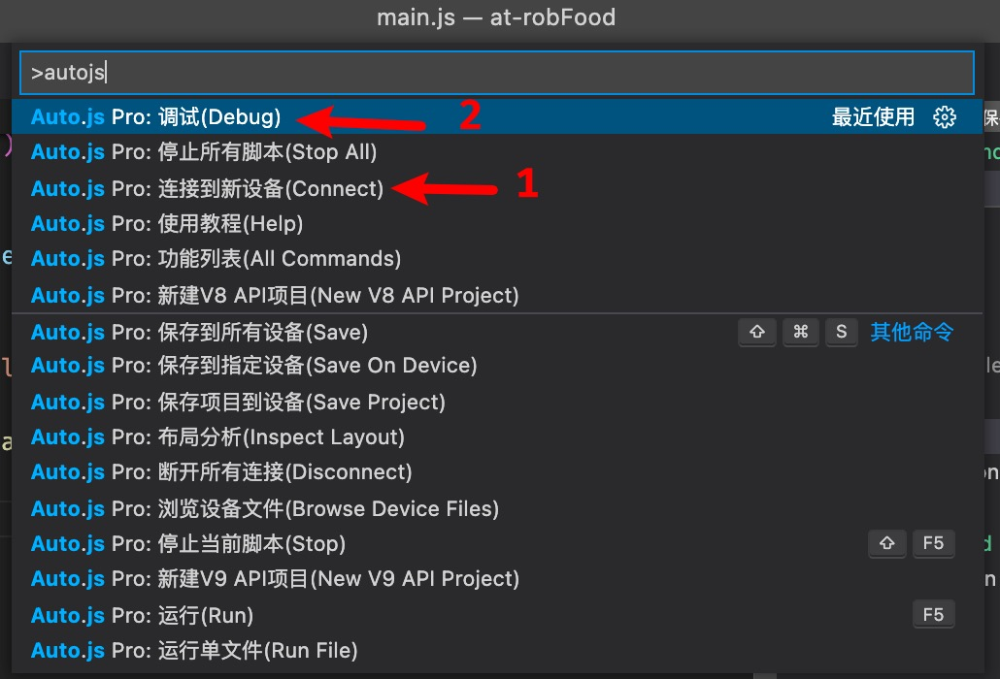

本项目纯属学习~不要违规违法造成法律责任概不负责。
仅支持安卓手机。

## 纯使用

1. 手机上安装 autojs 文件夹中的两个 app
2. 直接将meituan.js和dingdong.js导入AutoJs APP中
3. 打开【无障碍服务】和【悬浮窗】功能
4. 运行脚本即可

## 开发指南

1. 推荐使用 vscode 编辑器
2. 安装 vscode 插件 Auto.js-Pro-Ext
3. 安装项目依赖
   `npm 版本 8.1.0`
   `npm install`
4. 手机上安装 autojs 文件夹中的两个 app
5. 打开 autojs app，打开无障碍服务、链接电脑：客户端模式和服务器模式都打开（手机和电脑连接相同的 wifi）
   
6. vscode 连接到新设备
7. vscode 选择刚刚连接的设备进行调试
   

